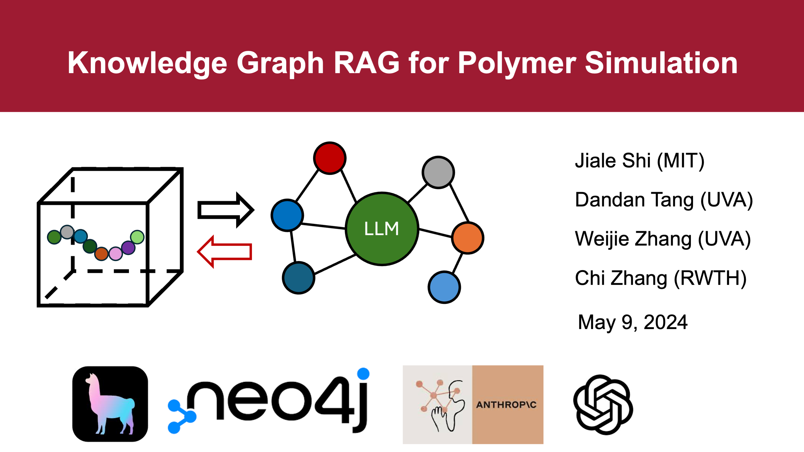

# Knowledge-graph based  RAG for Polymers Modeling and Simulation

Polymers modeling and simulation are important to explore the mechanisms of polymer properties and accelerate the design of new polymeric materials.
However, there are some barriers to learn and under polymers modeling and simulation. We hope to build this Knowledge-graph based  RAG and LLM to make it easy for new users. 

[Slides](./kg-rag-llm-slides.pdf)

[Youtube](https://www.youtube.com/watch?v=VXMX4sJVxdE)

[Twitter](https://twitter.com/Jiale_Shi/status/1788669935293796727)

# Notebook
[llamaindex version](./notebook/llamaindex_RAG_Polymer_Simulation_Template.ipynb)

[langchain version in developing](./notebook/langchain_RAG_Polymer_Simulation_Template.ipynb)

